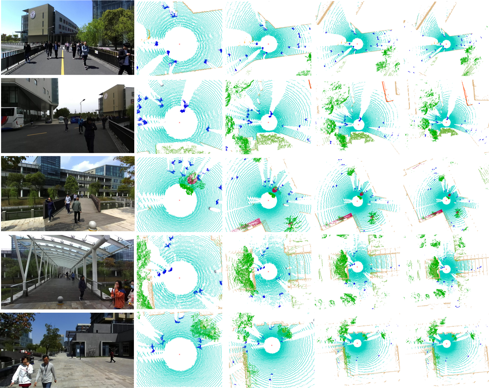
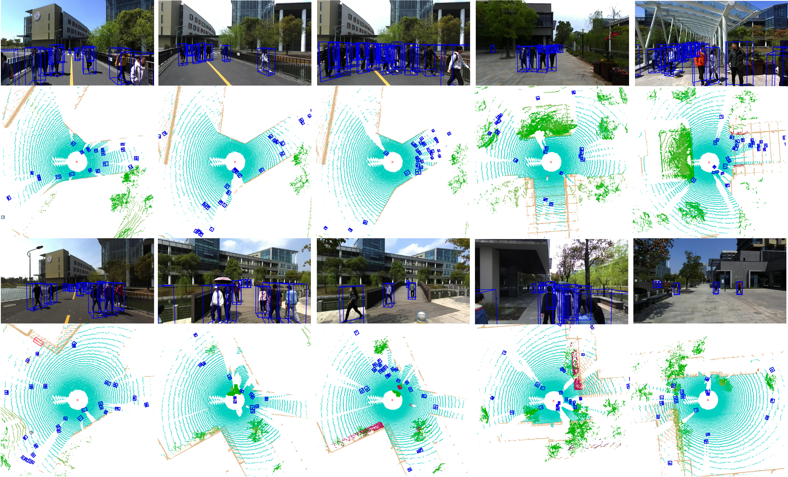
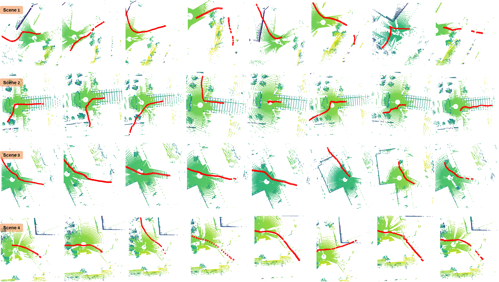

# PFSD: A Multi-Modal Pedestrian-Focus Scene Dataset for Rich Tasks in Semi-Structured Environments

This is the official website to post information about ***PFSD***. For more details, please refer to: **PFSD [[Paper](https://arxiv.org/abs/2502.15342)]** <br />

The **Pedestrian-Focused Scene Dataset (PFSD)** is a multi-modal dataset designed to enhance pedestrian perception. Unlike conventional datasets that emphasize vehicular traffic, PFSD focuses on **dense pedestrian interactions** in **semi-structured scenes**, where pedestrians exhibit dynamic and complex behavior.

The link to get dataset: https://pan.baidu.com/s/19DN4csVlMnrIYOKByBrZvQ 
Code: pfsd

## Key Features
- **Multi-modal sensor data**: LiDAR and camera-based annotations in the **nuScenes format** for compatibility with modern perception frameworks.
- **Dense pedestrian annotations**: High-resolution labeling of pedestrian movement in real-world urban settings.
- **Support for multiple tasks**: Enables **detection, tracking, and segmentation** in one dataset.
- **Challenging scenarios**: Captures **real-world pedestrian behavior**, including crowd movement, occlusions, and interactions.

### For Segmentation


### For Detection


### For Tracking


## Getting Started
### Installation

#### a. Clone this repository
```shell
git clone https://github.com/VSlabRobotics/PFSD.git && cd PFSD
```
#### b. Install the environment

Follow the install documents for [OpenPCDet](docs/INSTALL.md and prepare needed packages.

#### c. Prepare the dataset 

Get dataset from the previous link.
For nuScenes format datasets, please follow the [document](https://github.com/open-mmlab/OpenPCDet/blob/master/docs/GETTING_STARTED.md) in OpenPCDet.

### Training

```shell
python train.py --cfg_file PATH_TO_CONFIG_FILE
#For example,
python train.py --cfg_file cfgs/nuscenes_models/hmfn.yaml
```

## License
All datasets are published under the Creative Commons Attribution-NonCommercial-ShareAlike. This means that you must attribute the work in the manner specified by the authors, you may not use this work for commercial purposes and if you alter, transform, or build upon this work, you may distribute the resulting work only under the same license.
